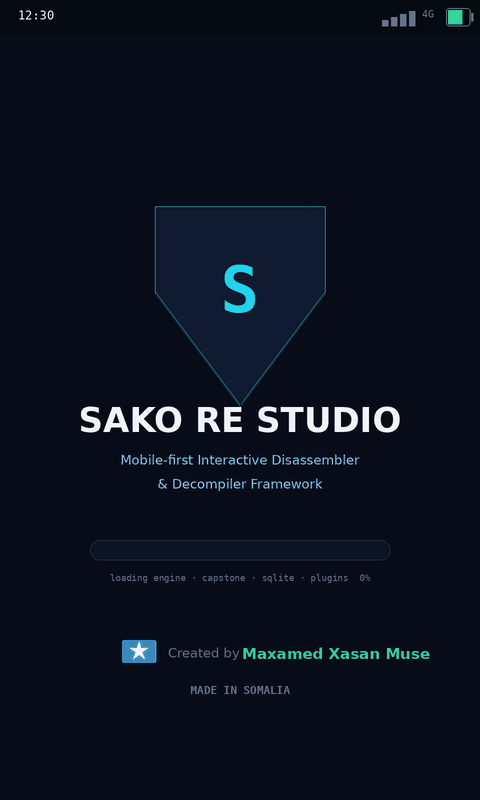

<div align="center">




# 🌙 Nocturne

### Mobile-first Interactive Disassembler & Decompiler Framework

*A fork of [Sako RE Studio](https://github.com/Maxamedxasa/SakoREStudio) by **Maxamed Xasan Muse** — rebranded, rethemed, and extended to decode every
architecture Capstone supports. Original work and MIT licence: see [Author](#-author).*

**IDA Pro & Ghidra — in your pocket**

[](https://github.com/trickhook/Re/releases/latest)
[](https://github.com/trickhook/Re/releases/latest)
[](#-known-limitations)
[](#-author)
[](#-author)
[](LICENSE)
[](https://github.com/trickhook/Re/actions/workflows/build.yml)

**[⬇️ DOWNLOAD APK](https://github.com/trickhook/Re/actions/workflows/build.yml)**



</div>

---
<a name="english"></a>

### 🧠 What is Nocturne?

**Nocturne** is a complete *reverse engineering* suite that runs entirely on your phone — an interactive disassembler, an IR-based decompiler, a call-graph explorer, a real ptrace debugger, an APK analyzer and a plugin scripting system, all inside one app. In the shortest possible terms: **it is IDA Pro / Ghidra, rebuilt mobile-first.** The engine is C++17 (Android NDK) powered by Capstone 4.0.2, the UI is modern Kotlin Jetpack Compose. It analyzes **APK · ELF · PE · DEX** binaries for **ARM64, ARM/Thumb, x86, x86-64, MIPS, PowerPC, SPARC and m68k** — little- and big-endian alike — plus SystemZ, which disassembles but does not decompile, because Ghidra ships no z/Architecture processor module and so there is no specification to compile — and every byte of that analysis stays on the device.

**What Nocturne does on the network.** Two permissions, both held for the in-app updater and
used by nothing else: `INTERNET` and `REQUEST_INSTALL_PACKAGES`. The updater talks to
`api.github.com` only when you ask it to — **Check for updates**, in the overflow menu or the
command palette — or once at startup if you turn on *Check on launch*, which ships off. There is
no timer, no background service, no crash reporting and no analytics of any kind. Nothing else in
the app opens a socket: no binary you open, no function name you type, no comment, bookmark, note
or project database ever leaves the phone. What the updater fetches it refuses to install unless
the file's SHA-256 matches the digest published with the release **and** the APK's signing
certificate matches the copy of Nocturne already on the device — only then is it handed to
Android's own installer, which asks you again before anything is replaced.

Built end-to-end by a Somali developer — the first mobile reverse-engineering studio of its kind out of Somalia 🇸🇴

### ✨ Features

| # | Feature | What it does |
|---|---------|--------------|
| 1 | 🗄️ **Project Database (SQLite)** | Every rename, comment, bookmark and note persists per-project — close the app, reopen, nothing is lost |
| 2 | 🔍 **Deep Analysis Engine** | Automatic function discovery, real call graph (PLT/GOT/IAT resolution), xrefs, C++ demangler (Itanium + MSVC), auto-comments (string refs, dangerous APIs ⚠) |
| 3 | ⚙️ **IR Decompiler** | ASM → **IR** → pseudo-C: expression trees, propagation, dead-store elimination, `while` loops from back-edges, `if/else` structuring, call arguments, typed declarations (`u64 a0`) |
| 4 | 🕸️ **Interactive Graph View** | CFG canvas: drag nodes, zoom, color-coded blocks (green=entry, red=exit, amber=branch), search + **minimap** |
| 5 | 🐞 **Real Debugger** | ptrace session: **Spawn / Attach PID**, software breakpoints (BRK / 0xCC with auto-rewind), register read/write, memory read/write, stack view, thread list |
| 6 | 📦 **APK Analyzer** | Binary AXML manifest parser: package/version/SDK, **permissions** (dangerous ones flagged ⚠), components + intent-filters, DEX classes, native libs, resources with image preview |
| 7 | 🧩 **Plugin System (NocturneScript)** | An embedded scripting language (variables, if/while/for, functions) + a 20+-function host API. 4 plugins bundled |
| 8 | 📱 **Modern UI** | 13 tabs, **command palette (Ctrl+K)**, search everywhere (Ctrl+F), goto address (Ctrl+G), full keyboard shortcuts (F1 = help) |

### 📲 Install

1. Grab the APK from [**Actions → Build APK → Artifacts**](https://github.com/trickhook/Re/actions/workflows/build.yml) (`Nocturne-debug-apk`), or from [**Releases**](https://github.com/trickhook/Re/releases/latest)
2. Open the APK → if prompted, allow **"Install unknown apps"**
3. Install → open → **done!** (Android 8.0+ · arm64-v8a & x86_64 · no root required — only the debugger needs root/debuggable)

### 🚀 Quick Start

1. **Open a binary** — tap **📂** (or `Ctrl+K` → "Open file") and pick `.apk` / `.so` / `.dex` / `.exe`. Ready-made samples live in `app/samples/` (test.so, test_arm64.so, test.dex, test.exe) — push them to the phone and open them.
2. **Automatic analysis** — the engine discovers functions, strings, imports/exports, xrefs and the call graph by itself. The **Console** tab narrates everything: `OK · 7,012 functions · 14,203 xrefs`.
3. **Assembly** — pick a function: Capstone disassembly with auto-comments (string references, call targets, dangerous APIs ⚠). **Long-press** any line → rename / comment / bookmark (persisted to SQLite).
4. **Pseudo-C** — the decompiler tab: ASM → IR → readable C-like code with loops, branches and call arguments, plus pipeline stats (IR nodes, DSE, loops).
5. **Graph** — the function's control-flow graph: drag nodes, pinch-zoom, color-coded blocks, minimap for fast navigation.
6. **CallGraph** — whole-binary tree or per-function callers/callees; imports highlighted in amber.
7. **APK** — decoded manifest, permissions (dangerous flagged ⚠), components with intent-filters, DEX classes, native libs (**tap = extract + analyze**), resources (**tap image = preview**).
8. **Debugger** *(root/debuggable device)* — **Spawn** (e.g. `/system/bin/toybox sleep 30`) → **BP @ function** → on hit inspect registers/memory/stack/threads → **Continue**. Or **Attach** to a running PID.
9. **Plugins** — run the 15 bundled NocturneScript plugins; effects are applied straight into the project database. `string-decryptor` emulates every function and reports the plaintext it wrote, `obfuscation-profile` names the functions whose control flow is flattened, `packer-fingerprint` reads the section table and its entropy, `capability-reach` says what each exported entry point can reach, `detection-sites` finds the root/emulator/debugger checks.
10. **Save** — `Ctrl+S` persists the SQLite project; reopen later from **RECENT PROJECTS** in the drawer.

### 🧩 NocturneScript — the Plugin Language

```js
## Example: hunt dangerous APIs
n  = count_functions()
ni = count_imports()
log("functions:", n, "· imports:", ni)

risky = 0
for i in 0..ni-1 {
    imp = import_at(i)
    if classify(imp.name) == "dangerous" {
        log("[!] UNSAFE:", imp.name)
        risky = risky + 1
    }
}

for i in 0..n-1 {
    f = func_at(i)
    if f.size > 2048 {
        comment(f.addr, "LARGE function — audit manually")
    }
}
```

**Host API — the analysis.** `count_functions()` · `func_at(i)` · `func_by_name()` · `func_containing(addr)` · `count_strings()` · `string_at(i)` · `count_imports()` · `import_at(i)` · `count_exports()` · `export_at(i)` · `count_sections()` · `section_at(i)` · `count_needed()` · `needed_at(i)` · `find_bytes(text)`
**Host API — the code.** `count_xrefs_to(addr[, kind])` · `xref_to_at(addr, i[, kind])` · `count_callees(addr)` · `callee_at(addr, i)` · `reaches(from, to)` · `count_insns(addr)` · `insn_at(addr, i)` · `insn_stats(addr)`
**Host API — the emulator.** `emulate(addr, args[, maxInstr, timeoutMs])` · `count_emu_writes()` · `emu_write_at(i)` · `count_emu_calls()` · `emu_call_at(i)`
**Host API — effects and utilities.** `rename()` · `comment()` · `bookmark()` · `log()` · `demangle()` · `classify()` · `hex()` · `strlen()` · `charat()` · `str()`

The language has no arrays, so every list is a `count_X()` and an `X_at(i)`.
`emulate()` runs the analysed binary's own instructions: it is capped per call
(20,000 instructions, 250 ms, raisable only to 200,000 and 1 s) and per plugin
run (20 seconds of emulation in total, 4,096 runs). A plugin that sweeps 1,300
functions finishes; one that tries to hang gets `stop == "exhausted"` and a
sentence saying so.
**Language:** numbers/strings/bools/objects · `if/else` · `while` · `for i in a..b { }` · `fun f(x) { return x }`

### 🛠️ Build from Source

**Requirements:** Android Studio (Ladybug+) · NDK 27.2.12479018 · CMake 3.22.1 · JDK 17 (bundled with Studio)

```bash
git clone https://github.com/trickhook/Re.git
# Android Studio → File → Open → select the cloned folder
# wait for Gradle sync → Run ▶  (first sync downloads Gradle 8.10.2 + deps)
```

**Command line:**
```bash
./gradlew assembleDebug          # debug APK — works out of the box
```

**Build + install on a connected device in one step:**
```bash
./scripts/install-apk.sh                 # builds, installs over adb, launches the app
./scripts/install-apk.sh -s SERIAL       # when several devices are attached
./scripts/install-apk.sh --skip-build    # reinstall the APK you already built
```
Requires USB debugging and `adb` on your PATH. The debug APK is signed with the
standard Android debug key, so it installs with no keystore setup at all.

**Don't want to build locally? Download the APK from CI.**
Every push runs [`.github/workflows/build.yml`](.github/workflows/build.yml),
which provisions the pinned NDK/CMake, builds the native engine for both ABIs
and uploads the APK:

1. Open the [**Build APK**](https://github.com/trickhook/Re/actions/workflows/build.yml)
   workflow (or press **Run workflow** to start one by hand)
2. Pick the run → **Artifacts** → `Nocturne-debug-apk`
3. Unzip, then `adb install -r Nocturne-*-debug.apk` — or copy the APK to the
   phone and tap it (allow *Install unknown apps* when prompted)

The run summary lists each APK with its size and SHA-256. Pushing a `v*` tag
additionally attaches the APKs to a GitHub Release.

CI builds the **release** APK too, but only when release signing secrets are
configured on the repository — `RELEASE_KEYSTORE_BASE64` (the `.jks`,
base64-encoded), `RELEASE_KEYSTORE_PASSWORD`, `RELEASE_KEY_ALIAS` and
`RELEASE_KEY_PASSWORD`. Without them an unsigned release APK cannot be
installed, so CI skips it and ships the debug APK only.

**Release signing (optional):** create `app/keystore.properties` (gitignored):
```properties
storeFile=nocturne-release.jks
storePassword=your_password
keyAlias=your_alias
keyPassword=your_password
```
Generate a keystore with:
```bash
keytool -genkeypair -v -keystore app/nocturne-release.jks -alias your_alias \
  -keyalg RSA -keysize 2048 -validity 10000
```
Without this file, release builds simply produce an unsigned APK — debug builds always work.

**Project layout:**
```
app/src/main/
├── cpp/capstone/            vendored Capstone 4.0.2
├── cpp/sako/                C++17 engine: loaders (ELF/PE/DEX), disassembler,
│                            IR decompiler, deep analysis, call graph,
│                            debug session, NocturneScript interpreter, JSON API
├── cpp/sako_jni.cpp         JNI bridge
├── assets/plugins/          bundled NocturneScript plugins (4)
├── java/com/sakore/studio/
│   ├── data/ProjectDb.kt    SQLite project database
│   ├── engine/NativeBridge.kt
│   ├── model/ApkAnalyzer.kt binary AXML parser
│   ├── ui/                  Compose UI (13 tabs, graph, palette, debugger…)
│   └── vm/StudioViewModel.kt
└── samples/                 test.so · test_arm64.so · test.dex · test.exe
```

### ⚠️ Known Limitations

- **Debugger** needs a rooted or `ro.debuggable=1` device (SELinux may deny ptrace for system binaries). Breakpoints are software-based; no hardware watchpoints yet.
- **Decompiler** is a real IR pipeline, but not Hex-Rays: no switch/jump-table recovery and no exception handling. The IR lifter targets ARM64 and x86-64; other architectures disassemble fully but decompile heuristically.
- **RISC-V, SuperH and IA-64** ELFs are identified and parsed, but Capstone 4.0.2 has no decoder for them, so no disassembly is produced.
- **DEX bytecode disassembly** is not included (Capstone has no Dalvik backend) — classes, methods, strings and the invoke-based call graph are fully available.
- **resources.arsc** names are not decoded yet (entries listed + image previews work).

---

<a name="qoraaga"></a>
## 👤 Author

<div align="center">

### **Maxamed Xasan Muse** 🇸🇴

*Horumariye Soomaaliyeed — Somali Developer*

> *"Nocturne waa app-ka ugu horreeya ee noocaan ah oo Soomaaliya laga soo saaro.
> Cilmiga reverse engineering-ka waa inuu gaaraa qof kasta — telefoonka kaliya."*

**GitHub:** [github.com/Maxamedxasa](https://github.com/Maxamedxasa)

🇸🇴 **MADE IN SOMALIA — WITH PRIDE**

</div>

## 📄 License

[MIT](LICENSE) © 2026 Maxamed Xasan Muse

## ⭐ Support

If this project helped you, please **star ⭐ the repo** and share it!

